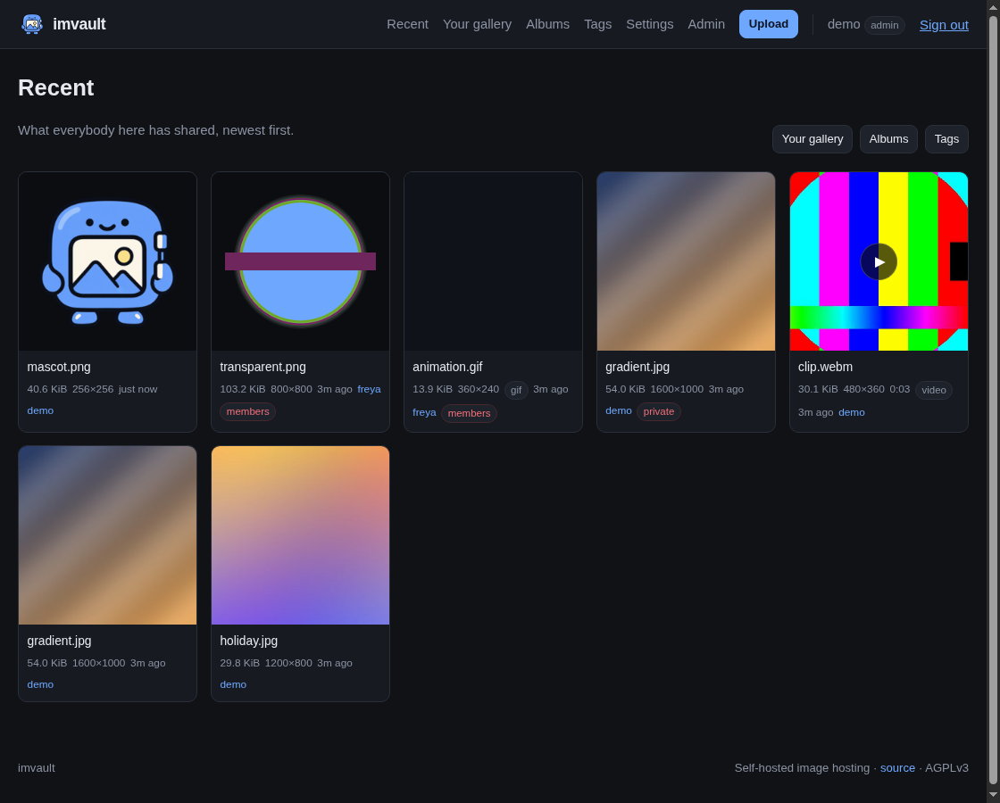

# imvault


**A little vault for your big collection of “I should save that.”**

Photographs, screenshots, GIFs, and short clips deserve a home that you run.
imvault is a small, self-hosted image host in the spirit of MLKSHK, Picsur,
[Chibisafe](https://github.com/chibisafe/chibisafe), and
[Imgur](https://imgur.com): part personal library, part clubhouse noticeboard.

One Go binary. One data directory. A small blue keeper with no opinions about
how many pictures of your cat you upload.

Public for an audience, members-only for your people, private for the
“I'll organise these later” collection. You decide who gets in.

<br clear="right">



*The actual local demo, stocked with sample media.*

## Come on in

```bash
make demo
```

Open <http://localhost:8080>. The demo stocks a throwaway `./demo-data` directory
with three accounts, sample media, a shared album, tags, an invitation, and a
moderation queue. It prints the sign-ins and a small tour; Ctrl-C closes up shop.
`make clean-demo` removes the demo data.

```bash
PORT=9000 make demo   # somebody already parked on 8080?
make help            # the rest of the toolbox
```

The keeper gets an admin account through the local provisioning command.
Members and sample content come through the same HTTP routes people use.

## What's in the vault?

| | |
| --- | --- |
| **Pictures that stay pictures** | JPEG, PNG, WebP, BMP, TIFF, animated GIFs and WebPs. Thumbnails and previews are made once, with orientation and transparency handled. |
| **A home for little movies** | WebM, MP4, and MOV clips, served with range requests. Optional ffmpeg supplies posters and duration checks; originals are never transcoded. |
| **A library, not a pile** | Galleries, albums, tags, and a recent feed. Shared albums let members contribute their own uploads. Identical uploads share stored bytes. |
| **Your audience, your call** | Public, members-only, and private visibility. Photograph metadata controls help keep camera details and location out of public downloads. |
| **Keys for people and scripts** | Invitations, member/moderator/admin roles, TOTP two-factor authentication, OpenID Connect, password resets, and a bearer-token API. |
| **A broom cupboard** | Reports, a moderation log, account exports and deletion, storage quotas, upload limits, rate limiting, anonymous-upload expiry, and queued mail with retries. |

The front end is server-rendered Go templates with htmx. No JavaScript build
step, no framework bundle to assemble, no external service required to get
started. [How it fits together](docs/architecture.md).

## Your place, your house rules

Start with a **Personal**, **Group**, or **Public** profile in **Admin → Settings**,
then adjust it to taste. These are settings, not separate editions.

Anonymous uploads have a plain on/off control:
**Admin → Settings → Anonymous uploads → Allow uploads without an account**.
Check or uncheck it and save. It takes effect immediately and survives restarts.
Anonymous files are public and expire after the configured retention window.

Create your administrator locally with `imvault create-admin --username NAME
--password-stdin`. Public registration always creates members and respects the
signup policy, even on an empty instance. See
[provisioning an administrator](docs/accounts.md#provisioning-an-administrator)
for password input and service-account examples.

## Make it yours

### From source

Building requires **Go 1.26 or later**. The server has no cgo dependency.

```bash
make run                              # :8080, data in ./data
make run PORT=9000 DATA_DIR=/tmp/imv   # a different doorstep
```

Or build the single binary directly:

```bash
go build -o bin/imvault ./cmd/imvault
IMVAULT_DATA_DIR=./data ./bin/imvault
```

### Gentoo and other native installs

```bash
sudo make install PREFIX=/usr
sudo make install-openrc
```

Create the service account and configure `/etc/conf.d/imvault` before starting
it. `contrib/gentoo/` contains a live ebuild and its account packages for an
overlay. A systemd unit and Alpine APKBUILD are included too.
[Deployment](docs/deployment.md) covers the full setup, service paths, and TLS.

For a source install with systemd:

```bash
sudo make install              # /usr/local/bin/imvault
sudo make install-systemd
```

### Docker

```bash
docker build -t imvault .
docker run -d --name imvault \
  -p 8080:8080 \
  -v imvault-data:/data \
  -e IMVAULT_ALLOW_SIGNUP=false \
  imvault
```

The image includes ffmpeg. The local Compose stack is one command away:

```bash
make compose-up
make compose-down
```

For a TLS-facing stack, `contrib/caddy/` includes Caddy configurations and a
Compose file that keeps the application's port behind the proxy.

## Keep the keys somewhere sensible

The keeper is cute. Backups are still your job.

- **Back up `secret.key` alongside the database and objects.** The key is needed
  to decrypt TOTP secrets. See [Operations](docs/operations.md).
- **Use TLS and secure cookies.** Set `IMVAULT_SECURE_COOKIES=true`, bind a native
  install to loopback, and configure the reverse proxy as described in
  [Deployment](docs/deployment.md).
- **Set your house rules before opening the doors.** Decide on signup,
  anonymous uploads, retention, and a storage ceiling. Defaults favour trying
  the app locally; [Configuration](docs/configuration.md) lists every knob.

[Security](docs/security.md) explains credential storage, access controls,
metadata handling, and the limits of those protections.

## The honest rough edges

- Clips keep their original codecs. If a browser cannot play one, imvault does
  not transcode it into something it can. There is no HLS or adaptive streaming.
- Without ffmpeg, clips get placeholder posters and their duration cannot be
  checked. Animated WebP posters also depend on the decoder's first-frame support.
- Metadata hiding fails closed when a format cannot be scrubbed: the original
  is withheld from the affected audience. Account exports retain originals.
- API keys manage files, albums, and tags, and download media. Account settings,
  key management, and admin operations require a browser session.
- Email resets require an SMTP relay; administrators can issue reset links
  without one. Queued mail retries run on a timer.
- Rate limits are in-memory and per process. Multiple server processes have
  separate budgets. Storage accounting can drift after a killed upload; the
  admin dashboard can recalculate it.
- Two-factor authentication is TOTP with recovery codes; there is no WebAuthn
  or hardware-key support yet.

## The map

| Guide | What's there |
| --- | --- |
| [Configuration](docs/configuration.md) | Environment settings, instance profiles, quotas, and rate limits |
| [Accounts](docs/accounts.md) | Invitations, sign-in, two-factor, roles, and moderation |
| [Media](docs/media.md) | Formats, renditions, clips, and photograph metadata |
| [API](docs/api.md) | Upload and manage your collection from scripts |
| [Routes](docs/routes.md) | Every URL the server answers |
| [Deployment](docs/deployment.md) | Gentoo, Alpine, init scripts, containers, and TLS |
| [Operations](docs/operations.md) | Backups, maintenance, upgrades, and troubleshooting |
| [Security](docs/security.md) | The security model and its edges |
| [Architecture](docs/architecture.md) | Internals, tests, and contributing changes |

Working on the code? `make check` runs formatting checks, vet, Go and JavaScript
tests, and a cyclomatic-complexity ceiling of 15 for production Go functions.
`make test-race` and `make test-browser` cover concurrency and browser behaviour.

## License

Copyright (C) 2026 Marcus J. Hildum.

GNU Affero General Public License, version 3 or later. See [LICENSE](LICENSE).
This program comes without any warranty.

The footer links to the source. If you run a modified version, point
`IMVAULT_SOURCE_URL` at the corresponding source for your instance.
